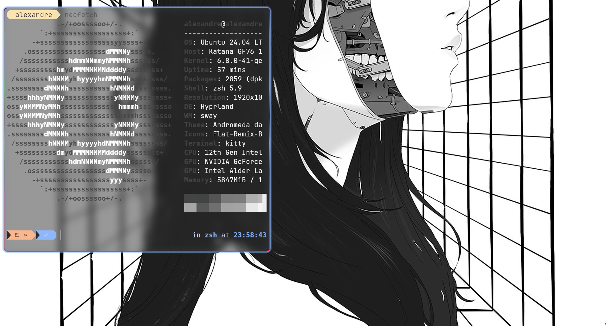
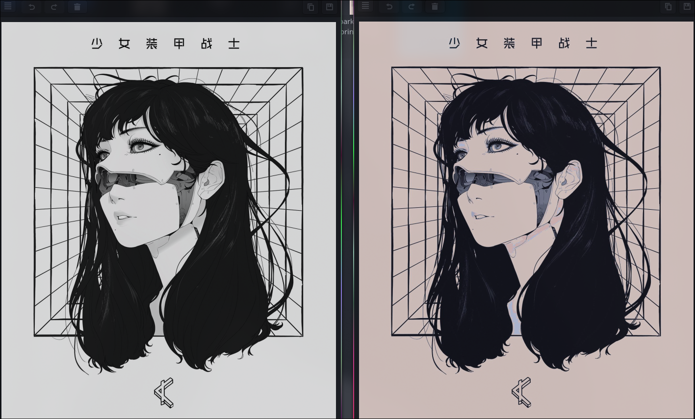
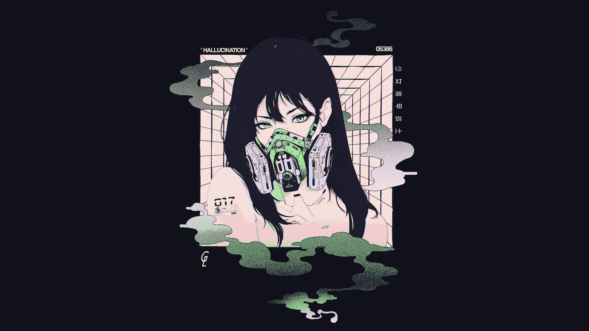
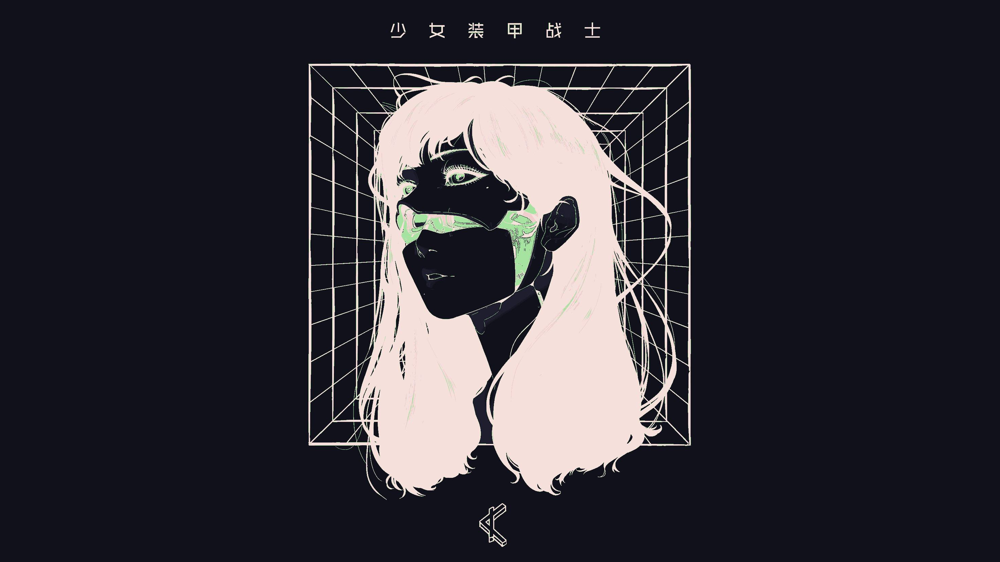

# Python Theme Converter

Python theme converter is a small python script that was made to filter any image with a specific color palette.

# The problem
If you're like me have already tried tool like [PyWal](https://github.com/dylanaraps/pywal) or [Wallust](https://codeberg.org/explosion-mental/wallust) to make sure you're background has 
matching colors with the rest of your working environment. 

However, at one point you may have had a color palette that looks like this...

This is not exactly a good color palette. You may have a lot of different colors that 
becomes indistinguishable and, especially if you're coding and need a lot of colors for different keywords, that can 
become quite bothersome.

# The solution

Instead of making a color palette based on your background, why not
choose your background based on your color palette ? Well this seem quite restricting...

Not anymore ! This script will take any image and apply a simple filter based on your color palette
of choice.

Here, let me show you with Catppuccin Mocha !
```commandline
python theme_filter.py image.png new_image.png "catppuccin-mocha"
```



Well ok... the colors do match the theme we gave the program, but also it's not that convincing since it's like just a 
different gray scale. And yes, let's no do that, we can just remove the gray value in our color palette. And by "we" I 
mean "I did it, so you don't have to". For every palette I put a "color" variant to force our black and white image to 
get a little bit more character. 
And since we're at it, let's put some padding left and right to get the landscape format. 
```commandline
python theme_filter.py image.png new_image.png "catppuccin-mocha-color" --landscape
```


Okay that's better ! But do you know how can we give it even more color without making it too degenerate ? Well if so 
do a pull request because I don't.

Finally, the last issue I have a want to tackle, is that catppuccin-mocha est a dark theme, and some of our backgrounds
are white. Thankfully, we had all these issue because we've been working with black and white images, and we can 
actually take the negative without making it look too weird.

```commandline
python theme_filter.py image.png new_image.png "catppuccin-mocha-color" --landscape --negative
```

Now, do this looks like as good as the original ? No. But it does match our theme, and it's good enough for me. If you 
use a tiling window manager you basically never see your background clearly anyway.

And voilà, that's all I had to say about that. 

# How to use ?

clone this repo, then open a terminal inside its folder, then type the commands I showed you earlier.

## Dependencies
 * Python
 * python-opencv (pip)

## How to add a color palette ?
Just add en entry in the json file, with the name of the palette and the [R, G, B] values for all the colors of the 
palette. Remember that you may want to exclude some of the color on the gray scale if you don't want the output to be 
just black and white.

# Available themes
- [x] Catppuccin (Latte, Frappé, Machiatto, Mocha)
- [x] Nord
- [x] Dracula
- [ ] Solarized
- [ ] Gruvbox

# Credits
All the artwork used for this presentation is the work of Gharliera
* [Artstation](https://www.artstation.com/gharly)
* [Instagram](https://www.instagram.com/gharliera)

